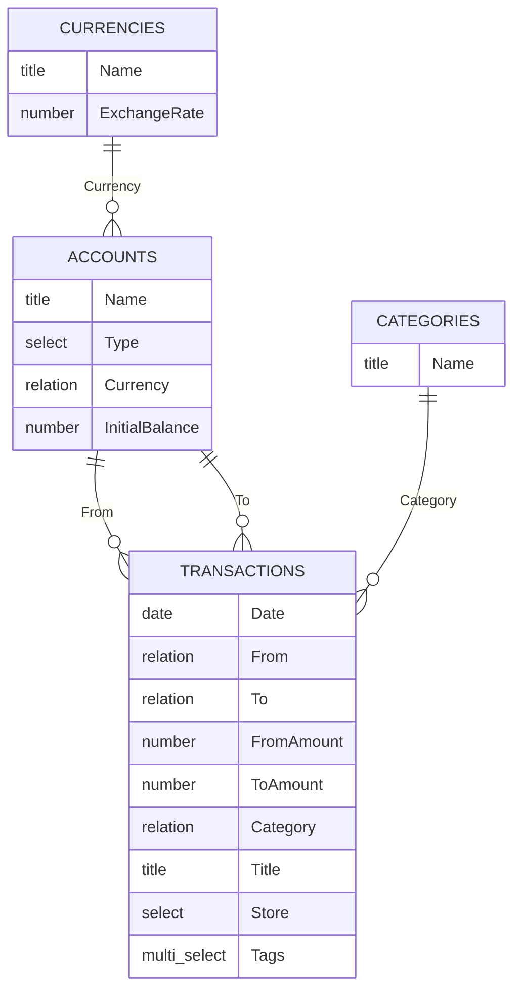

# Notion Data Source Setup Guide

This guide helps you create the Notion data sources required by this project from scratch.

## Overview

You need 4 Notion data sources (databases):

- `Currencies`
- `Accounts`
- `Categories`
- `Transactions`

Create them first, then wire the relations exactly as shown.

## Entity Relationship Diagram



## Step 1: Create `Currencies`

Create a new Notion data source named `Currencies` with these properties:

- `Name` (`title`, required): currency code such as `USD`, `TWD`, `JPY`.
- `Exchange Rate` (`number`, required): exchange rate (example: `USD = 1`, `EUR = 0.93`).

## Step 2: Create `Accounts`

Create `Accounts` with these properties:

- `Name` (`title`, required): unique account name.
- `Type` (`select`, required): account type.
- `Currency` (`relation` -> `Currencies`, required): linked currency.
- `Initial Balance` (`number`, required): opening balance.

`Type` options should include:

- `General`
- `Bank`
- `Credit Card`
- `Cash`
- `Liability`

Example rows:

- `Cash Wallet` / `Cash` / `TWD` / `0`
- `Chase Checking` / `Bank` / `USD` / `1000`

## Step 3: Create `Categories`

Create `Categories` with:

- `Name` (`title`, required): category name.

Example rows:

- `Food`
- `Transport`
- `Salary`
- `Transfer`
- `Other`

## Step 4: Create `Transactions`

Create `Transactions` with these properties:

- `Date` (`date`, required): transaction date/time.
- `From` (`relation` -> `Accounts`, optional): source account.
- `To` (`relation` -> `Accounts`, optional): destination account.
- `From Amount` (`number`, optional): amount deducted from `From`.
- `To Amount` (`number`, optional): amount added to `To`.
- `Category` (`relation` -> `Categories`, required): transaction category.
- `Title` (`title`, optional): one-line short description.
- `Store` (`select`, optional): merchant/store.
- `Tags` (`multi_select`, optional): labels.

## Transaction patterns (must follow)

This project determines transaction type from `From`/`To` and amount fields:

- `Expense`: `From` + `From Amount` filled, `To` + `To Amount` empty.
- `Income`: `To` + `To Amount` filled, `From` + `From Amount` empty.
- `Transfer`: all of `From`, `From Amount`, `To`, `To Amount` filled.

## Step 5: Save data source IDs to config

After all 4 data sources are created, copy their data source IDs into:

- `.cursor/skills/notion-accounting-schema/assets/config.json`

How to get each data source ID in Notion:

1. Open the database in Notion.
2. Open database settings.
3. Select `Manage data sources`.
4. In the data source list, click `...` on the target data source.
5. Click `Copy data source ID`.
6. Paste it into the matching key in `config.json`.

Use this structure:

```json
{
  "currenciesDataSourceId": "your-currencies-data-source-id",
  "accountsDataSourceId": "your-accounts-data-source-id",
  "transactionsDataSourceId": "your-transactions-data-source-id",
  "categoriesDataSourceId": "your-categories-data-source-id"
}
```

You can start from:

- `.cursor/skills/notion-accounting-schema/assets/config.example.json`

## Validation checklist

Before using the project, verify:

- All 4 data sources exist and names are clear.
- Property names and types exactly match this guide.
- Relations are linked to the correct target data source.
- `Accounts.Currency` always points to a valid `Currencies` row.
- `Transactions.Category` points to a valid `Categories` row.
